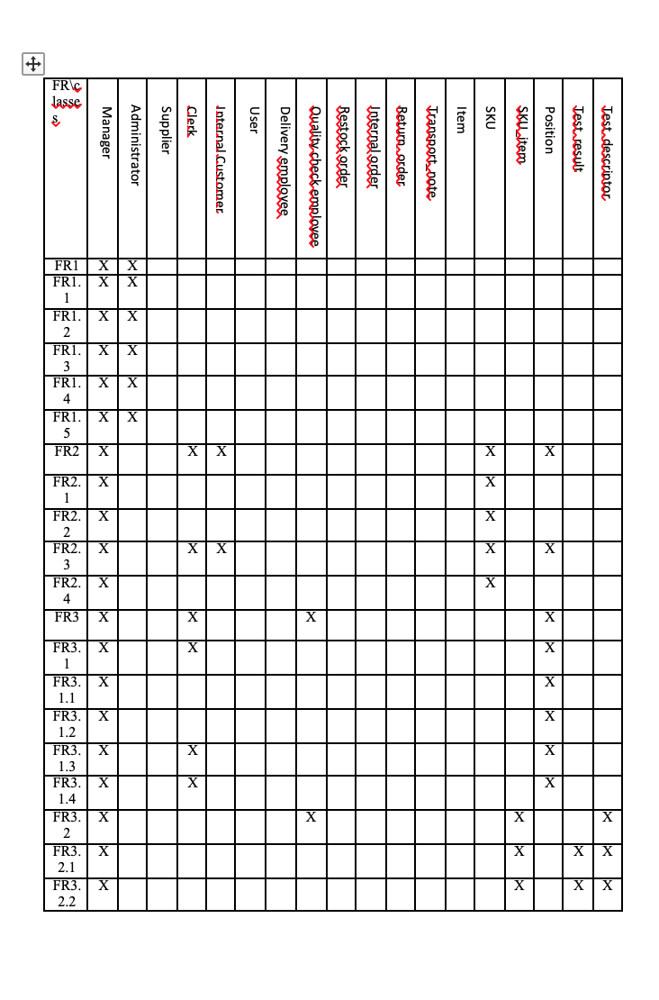
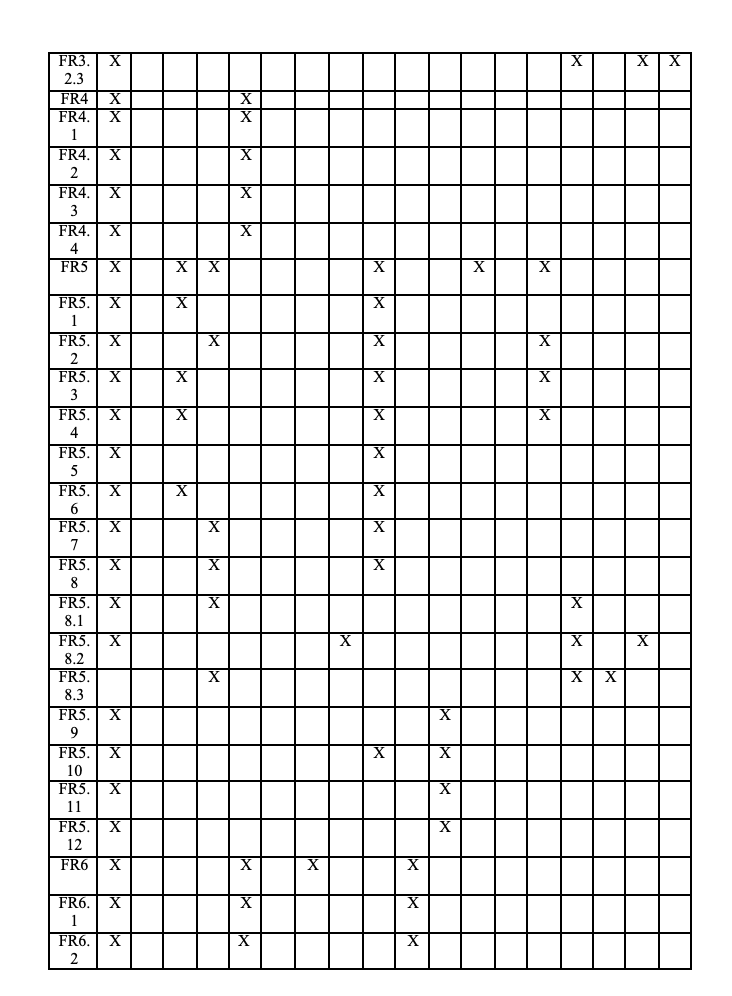
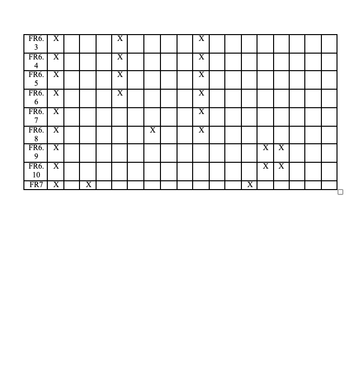

# Design Document 

Authors: Alessio Salta, Giulia Mannaioli, Masoud Karimi, Gabriele di Bartolomei

Date:21/04/2022

Version:1.0

# Contents

- [Design Document](#design-document)
- [Contents](#contents)
- [Instructions](#instructions)
- [High level design](#high-level-design)
- [Low level design](#low-level-design)
- [Verification traceability matrix](#verification-traceability-matrix)
- [Verification sequence diagrams](#verification-sequence-diagrams)

# Instructions

The design must satisfy the Official Requirements document 

# High level design 

<discuss architectural styles used, if any>

#Proposed architecture

For our design, a 3-tier architectural model was chosen. This kind of architecture offers several advantages, such as the capability to split the software in 3 layers, thus making 
possible a parallel implementation and maintenance of the various services. The 3 layers of a 3-tier architecture are described in the following:

<ul>
	<li>Presentation layer: it is the topmost layer of the architecture and it directly interacts with the user. All the functions related to this layer are responsible for taking data
	inserted by the user and passing them to the lower layers or making data coming from the other layers understandable in a clear way.</li>
	<li>Application layer: it contains functions related to the core of our application. This layer can receive data from the data layer or from the presentation layer
	and it is in charge of all the elaborations. Results, then, can be provided to the user through the user interface or stored in the data layer.</li>
	<li>Data layer: this layer store the database or any other kind of data storage system. Data functions interact with the database system to store or extract data which
	can be used by the upper layers for processing or interpretations</li>
</ul>
<report package diagram>

# Low level design

#verification-traceability-matrix

# Verification traceability matrix

<for each functional requirement from the requirement document, list which classes concur to implement it>

# Verification sequence diagrams 
<select key scenarios from the requirement document. For each of them define a sequence diagram showing that the scenario can be implemented by the classes and methods in the design>

