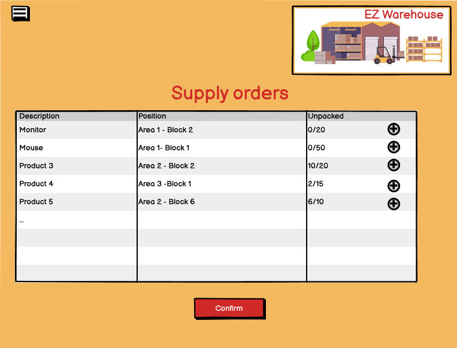

# Graphical User Interface Prototype  

Authors:Alessio Salta, Giulia Mannaioli, Gabriele Di Bartolomei, Masoud Karimi

Date:12/04/2022

Version:1.0

Mobile graphical use interface: this GUI was created for warehouse and organisational unit employees. The main purpose is to help these actors handling orders and item management but other features were added, such that visualisation of product's characteristic and supplier's details.

The following images refer to the implementation of the mobile interface

Desktop graphical use interface: this GUI was created for administrator, manager, warehouse, organisational unit and quality check employees.

The following images refer to the implementation of the desktop interface.

.png)

.png)

.png)

.png)

.png)

.png)

.png)

.png)

.png)

.png)

.png)

.png)

.png)

.png)

.png)

.png)

.png)

.png)

.png)

