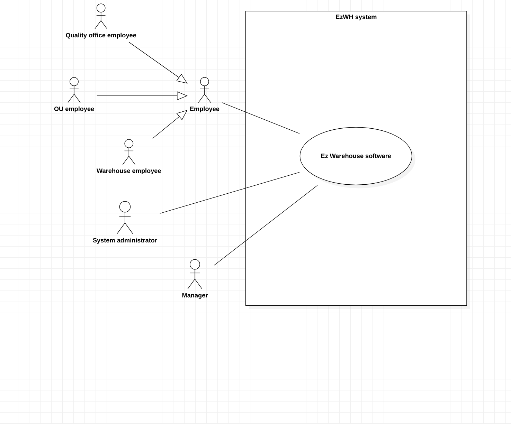
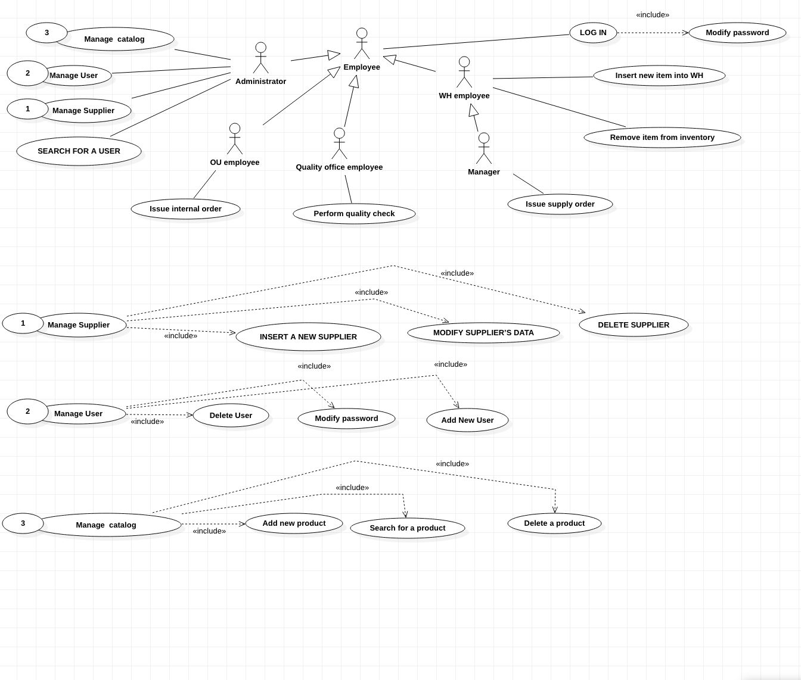
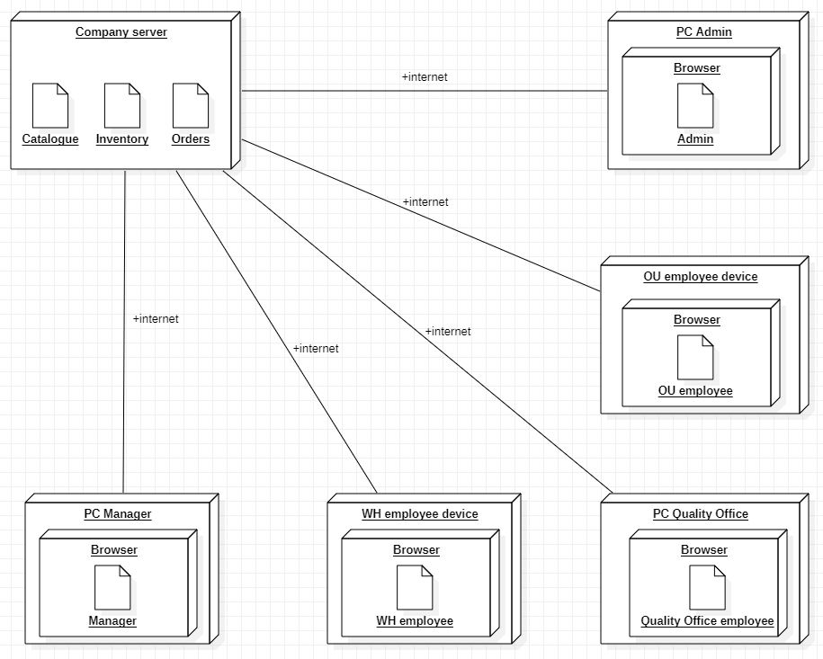

 #Requirements Document 

Date: 22 march 2022

Version: 0.0

 
| Version number | Change |
| ----------------- |:-----------|
| | | 

# Contents

- [Informal description](#informal-description)
- [Stakeholders](#stakeholders)
- [Context Diagram and interfaces](#context-diagram-and-interfaces)
	+ [Context Diagram](#context-diagram)
	+ [Interfaces](#interfaces) 
	
- [Contents](#contents)
- [Informal description](#informal-description)
- [Stakeholders](#stakeholders)
- [Context Diagram and interfaces](#context-diagram-and-interfaces)
	- [Context Diagram](#context-diagram)
	- [Interfaces](#interfaces)
- [Stories and personas](#stories-and-personas)
- [Functional and non functional requirements](#functional-and-non-functional-requirements)
	- [Functional Requirements](#functional-requirements)
	- [Non Functional Requirements](#non-functional-requirements)
- [Use case diagram and use cases](#use-case-diagram-and-use-cases)
	- [Use case diagram](#use-case-diagram)
		- [Use case 1, UC1 - Log in](#use-case-1-uc1---log-in)
		- [Use case 2, UC2 - Insert user in the system](#use-case-2-uc2---insert-user-in-the-system)
		- [Use case 3, UC3 - Delete a user](#use-case-3-uc3---delete-a-user)
		- [Use case 4, UC4 - Modify password](#use-case-4-uc4---modify-password)
		- [Use case 6, UC6 - Insert a supplier into the system](#use-case-6-uc6---insert-a-supplier-into-the-system)
		- [Use case 7, UC7 -  Delete supplier from the system](#use-case-7-uc7----delete-supplier-from-the-system)
		- [Use case 8, UC8 - Modify supplier's data](#use-case-8-uc8---modify-suppliers-data)
		- [Use case 9, UC9 - Add product to catalog (manage free space)](#use-case-9-uc9---add-product-to-catalog-manage-free-space)
		- [Use case 10, UC10 - Delete product from catalog](#use-case-10-uc10---delete-product-from-catalog)
		- [Use case 11, UC11 - Issue an internal order](#use-case-11-uc11---issue-an-internal-order)
		- [Use case 12, UC12 - Issue a supply order](#use-case-12-uc12---issue-a-supply-order)
		- [Use case 13, UC13 - Perform quality check](#use-case-13-uc13---perform-quality-check)
		- [Use case 14, UC14 - Insert new item into warehouse](#use-case-14-uc14---insert-new-item-into-warehouse)
		- [Use case 15, UC15 - Remove item form inventory](#use-case-15-uc15---remove-item-form-inventory)
- [Scenarios](#scenarios)
- [Use case Diagram](#use-case-diagram-1)
- [Glossary](#glossary)
- [System Design](#system-design)
- [Deployment Diagram](#deployment-diagram)

# Informal description
Medium companies and retailers need a simple application to manage the relationship with suppliers and the inventory of physical items stocked in a physical warehouse. 
The warehouse is supervised by a manager, who supervises the availability of items. When a certain item is in short supply, the manager issues an order to a supplier. In general the same item can be purchased by many suppliers. The warehouse keeps a list of possible suppliers per item. 

After some time the items ordered to a supplier are received. The items must be quality checked and stored in specific positions in the warehouse. The quality check is performed by specific roles (quality office), who apply specific tests for item (different items are tested differently). Possibly the tests are not made at all, or made randomly on some of the items received. If an item does not pass a quality test it may be rejected and sent back to the supplier. 

Storage of items in the warehouse must take into account the availability of physical space in the warehouse. Further the position of items must be traced to guide later recollection of them.

The warehouse is part of a company. Other organizational units (OU) of the company may ask for items in the warehouse. This is implemented via internal orders, received by the warehouse. Upon reception of an internal order the warehouse must collect the requested item(s), prepare them and deliver them to a pick up area. When the item is collected by the other OU the internal order is completed. 

EZWH (EaSy WareHouse) is a software application to support the management of a warehouse.

# Stakeholders

| Stakeholder name  | Description | 
| ----------------- |:-----------:|
|   Manager     |  Supervises the availability of items, free/occupied space inside the warehouse, manages orders to suppliers   |
| Warehouse designers			|	Design the structure and the organization of the warehouse		|
| Supplier		|	Suppliers interact with the warehouse by providing items requested by managers|
| Retailers | They usually own small shops with a limited storage space and buys the SW  |
| Company | It owns one (or more) large warehouse and buys the SW|
| System administrators |	They maintain the EzWH software and also check orders, they keep the SW updated and operating 		|
| Programmers |	Programmers are responsible for implementing the general structure of the SW together with all its features; in addition, they are in charge of developing SW updates of any kind and to test them before they can be issued|
| Quality Office employee |	Responsible for testing items, evaluate them and then decide if they can be stored inside the warehouse. They are also in charge of writing down reports about evaluated items|
| OU(Organizational Units) employee|	They can ask for items in a warehouse and order them, can report issues with shippings/orders to/from the warehouse	|
| Warehouse employee |	They are responsible of collecting/packaging all the requested items in an order. They are also in charge of relocating items inside the same warehouse |
| Competitors| Other warehouse management systems|
| Investors| They provide funds to support the development of the SW| 

# Context Diagram and interfaces

## Context Diagram

\<Define here Context diagram using UML use case diagram>

\<actors are a subset of stakeholders>

## Interfaces
\<describe here each interface in the context diagram>

\<GUIs will be described graphically in a separate document>

| Actor | Logical Interface | Physical Interface  |
| ------------- |:-------------:| -----:|
|   Manager     | GUI | Monitor, keyboard |
|   System administrator    | GUI | Monitor, keyboard |
|   Quality Office employee     | GUI | Monitor, keyboard |
|   OU employee    | GUI | Monitor, keyboard, mobile device |
|   Warehouse Employee     | GUI | Monitor, keyboard, mobile device |

# Stories and personas

Mark is 70 and he is the owner of a __small, old shop__ in the city centre. The shop has a small warehouse on the back but Mark likes to keep things organized in a very
precise inventory, with each product traced in a unique way; to do so, he needs a simple application which can keep the inventory up-to-date and possibly send out 
notifications about orders, quality checks etc...

Adam is 40 and it is the main responsible for a __big warehouse__, owned by a multinational company. The company is organized into many departments, based
worldwide, so he needs to manage orders coming from internal departments; in addition, since the warehouse is resupplied by many suppliers, he must coordinate with a variety of external figures, as well as with quality offices.

Jillian is 30 and she is the manager of a __small shop, part of a big department store chain.__ The organization of the shop is not difficult for her but in some cases she has to manage a lot of orders coming from the central office of the company and also resupply the shop by using a list of suppliers associated with the company, so she needs to process orders and check the status of the inventory very quickly.

# Functional and non functional requirements

## Functional Requirements

\<In the form DO SOMETHING, or VERB NOUN, describe high level capabilities of the system>

\<they match to high level use cases>

| ID        | Description  |
| ------------- |:-------------:| 
|  FR1     | Manage authentication |
|  FR1-1     | Log in |
|  FR1-2     | Log out |
|  FR1-3  | Create, delete employee (admin)|
|  FR1-4  | Modify password |
|  FR1-5   | Search for an employee (Only for admin) |
|  FR2     | Manage suppliers |
|  FR2-1     | CRUD suppliers (admin) |
|  FR2-2     | Show the list of suppliers for a product (manager) |
|  FR3     | Product Management |
|  FR3-1     | Retrieve position of a certain item |
|  FR3-2     | Add and remove product from catalogue (admin) |
|  FR3-3     | Add and remove item from inventory |
|  FR3-4     | Retrieve product id from item id |
|  FR4     |  Manage quality check |
|  FR4-1     |  Select item to be checked |
|  FR4-2     |  Report the outcome of the test |
|  FR4-3     |  Retrieve specific tests for specific product |
|  FR4-4   |  Accept/Refuse an item |
|  FR5     | Search product |
|  FR5-1     | Check availability of a certain product  |
|  FR5-2     | Retrieve product location  |
|  FR5-3   |  Find for free space in WH |
| FR6 | Mange supply orders |
| FR6-1 | Create supply order (manger) |
| FR6-2 | View supply orders |
| FR6-3 | View and modify order staus |
|FR7 | Mange internal order |
| FR7-1 | Create internal order (OU employee) |
| FR7-2 | View internal order depending on the role|
| FR7-3 | View and modify order staus |

## Non Functional Requirements

\<Describe constraints on functional requirements>

| ID        | Type (efficiency, reliability, ..)           | Description  | Refers to |
| ------------- |:-------------:| :-----:| -----:|
|  NFR1     |  Usability | It requires little Knowledge to use the WH |All FR|
|  NFR2     |Performance| all functions should complete less than 0.5 second | All FR |
|  NFR3     | Portability| The application should work on many kind of OS(Windows,Linux,....) and different browsers|All FR |
| NFR4 |Reliability |the rate of failure should be acceptable |All FR especially related to orders |

# Use case diagram and use cases

## Use case diagram
\<define here UML Use case diagram UCD summarizing all use cases, and their relationships>

\<next describe here each use case in the UCD>

### Use case 1, UC1 - Log in
| Actors Involved        | Manager, administrator, warehouse employee, OU employee |
| ------------- |:-------------:| 
|  Precondition     | User exists in the system’s database but is not logged in |
|  Post condition     | User is authenticated and logged into the right area based on his/her specific role |
|  Nominal Scenario     | User U is logged in|
|  Variants     | User can be a manager, an admin, a warehouse employee or a OU employee |
|  Exceptions     | User does not exist|
|  | User inserts wrong username and/or password |

### Use case 2, UC2 - Insert user in the system
| Actors Involved        | Administrator |
| ------------- |:-------------:| 
| Precondition | User U does not exist in the database; user A is logged in as admin |
| postcondition | User is added into the database |
| Nominal scenario | Admin inserts a new user into the database |
| Exception | ID number already exists |

### Use case 3, UC3 - Delete a user 
|Actors involved | Administrator |
| ------------- |:-------------:| 
| Precondition | User U exists, User A is logged in as admin |
| Postcondition | User U is deleted from the system |
| Nominal scenario | Admin selects a user to be deleted |
| Exception | User does not exist |
|  | User is the admin |

### Use case 4, UC4 - Modify a user ///// to complete 
|Actors involved | Administrator |
| ------------- |:-------------:| 
| Precondition | User U exists, User A is logged in as admin |
| Postcondition | User U is modified |
| Nominal scenario | Admin selects a user to be deleted |
| Variants |  |
| Exception | User does not exist |
|  | User is the admin |

### Use case 5, UC5 - Modify password
| Actors Involved        | Manager, admin, warehouse employee, OU employee |
| ------------- |:-------------:| 
| Precondition | User U exists |
| Postcondition | User’s password has been modified |
| Nominal scenario | user modifies his/her password |
| Variants |  User can be a manager, an administrator, a warehouse employee or OU employee |
| Exception | inserted string for password must meet specific requirements in terms of security  |

### Use case 6, UC6 - Insert a supplier into the system

| Actors Involved        | Admin |
| ------------- |:-------------:| 
| Precondition | User U must be logged-in as an admin |
| Postcondition | New supplier is added to the system  |
| Nominal scenario |  user U adds new supplier  |
| Variants  | leaving out some optional fields during filling out the form|
| Exception | supplier was defined to system before  |

### Use case 7, UC7 -  Delete supplier from the system
| Actors Involved        | Admin |
| ------------- |:-------------:| 
| Precondition | Supplier S exists and User is logged-in as admin |
| Postcondition | Supplier S is deleted from the system |
| Nominal scenario | Admin deletes a supplier |
| Exception | Supplier does not exist |

### Use case 8, UC8 - Modify supplier's data
| Actors Involved        | Admin |
| ------------- |:-------------:| 
| Precondition | Supplier S exists and User is logged-in as admin |
| Postcondition | Supplier S is modified  |
| Nominal scenario | Admin modifies a supplier|
| Exception | Supplier does not exist |

### Use case 9, UC9 - Add product to catalog
| Actors Involved        | Admin |
| ------------- |:-------------:| 
| Precondition | The product is not in the catalog, user is logged in as admin |
| Postcondition | The product is in the catalog|
| Nominal scenario | The admin add a new product into the catalog|
| Exception | The product is already present|

### Use case 10, UC10 - Delete product from catalog 
| Actors Involved        | Admin |
| ------------- |:-------------:| 
| Precondition | The product is in the catalog, user logged in as admin |
| Postcondition | The product is deleted from the catalog|
| Nominal scenario | The admin deletes a product from the catalog |
| Exception | There are still items of that product in the warehouse |

### Use case 11, UC11 - Issue an internal order 
| Actors Involved        | OU employee |
| ------------- |:-------------:| 
| Precondition | User U logged in as OU employee |
| Postcondition | Internal order is issued|
| Nominal scenario | User U issues internal order |
| Exception | An ordered product is not available |

### Use case 12, UC12 - Complete internal order /////// to do
| Actors Involved        | OU employee |
| ------------- |:-------------:| 
| Precondition | User U logged in as OU employee |
| Postcondition | Internal order is issued|
| Nominal scenario | User U issues internal order |
| Exception | An ordered product is not available |

### Use case 13, UC13 - Issue a supply order 
| Actors Involved        | Manager|
| ------------- |:-------------:|
| Precondition | User U logged in as Manager |
| Postcondition | Supply order is issued |
| Nominal scenario |User U issues supply order from low availability list |
| Variant | User U manually creates order|
| Exception | There isn’t enough available space to accommodate the ordered quantity|

### Use case 14, UC14 - Search product ///////// da fare 
| Actors Involved        | Manager|
| ------------- |:-------------:| 
(ALSO CHECK FOR AVAILABILITY HERE)
| Precondition | User U logged in as Manager |
| Postcondition | Supply order is issued |
| Nominal scenario |User U issues supply order |
| Exception | There isn’t enough available space to accommodate the ordered quantity|
 

### Use case 15, UC15 - Insert new item into warehouse // unpack
| Actors Involved        | WH Employee, Manager|
| ------------- |:-------------:|
| Precondition | User U logged in as WH Employee or Manager, new batch of items has arrived |
| Postcondition | Item is accepted into WH|
| Nominal scenario | U inserts new item into warehouse |
| Exception | Product doesn’t exist in WH |

### Use case 16, UC16 - Remove item form inventory // pack
| Actors Involved        | WH Employee, Manager|
| ------------- |:-------------:| 
| Precondition | User U logged in as WH Employee or Manager |
| Postcondition | Item I is removed from inventory |
| Nominal scenario | User U removes item I from inventory |
| Exception | Item doesn’t exist in inventory |

### Use case 17, UC17 - Perform quality check
| Actors Involved        | Quality office employee|
| ------------- |:-------------:| 
| Precondition | User U logged in as Quality office employee, item I has been selected for quality check|
| Postcondition | Checked item is rejected or not |
| Nominal scenario | Item passes all tests and is accepted |
| Variants | Item doesn’t pass a test and is sent back  |

# Scenarios

| Scenario 1.1 |Log in user (correct username and password)|
| ------------- |:-------------:| 
| Precondition | User exists in the system’s database but is not logged in |
| Postcondition | User is authenticated and logged into the right area based on his/her specific role |
| Step | Description |
| 1 | User connects to the log in interface of the EZ Warehouse SW |
| 2 | User inserts username |
| 3 | User inserts password and presses the “Log In” button |
| 4 |  System checks for the correctness of username and password |
| 5 | System authenticates user |

| Scenario 1.2 |Log in user (wrong username and/or password)|
| ------------- |:-------------:| 
 | PRECONDITION | User exists in the system’s database but is not logged in |
| POSTCONDITION | User is asked to repeat the “log in “ procedure again ||
| Step | Description |
| 1 | User connects to the log in interface of the EZ Warehouse SW |
| 2 | User inserts username |
| 3 | User inserts password and presses the “Log In” button |
| 4 |  System checks for the correctness of username and password |
| 5 | Invalid user and/or password; the system displays an error message and returns to the “Log in” interface |

| Scenario 2.1 | Insert user in the system | 
| ------------- |:-------------:| 
| Precondition | User U does not exist in the database |
| Postcondition | User is added into the database |
| Step | Description |
| 1 | Admin inserts new user’s personal informations (name, surname, e-mail) |
| 2 | User is associated with a unique username |
| 3 | User is associated with a password |
| 4 | Admin authorizes the operation |
| 5 |  System checks for exceptions (i.e.: username already exists) |
| 6a | System sends out an error message if there are some exceptions |
| 6b | System registers new user |

|Scenario 2.2 | Insert user in the system (user already registered in the database)|
| ------------- |:-------------:| 
| Precondition | User U exists in the database |
| postcondition | An error message is displayed by the system|
| Step | Description |
| 1 | User is associated with a unique username |
| 2 | User is associated with a password |
| 3 | Admin authorizes the operation|
| 4 |  System checks for exceptions (i.e.: username already exists) |
| 5 | Username already exists; the system issues an error message to the admin |

| Scenario 3.1 | Delete a user in the system |
| ------------- |:-------------:| 
| Precondition | User U exists |
| Postcondition | User U is deleted from the system |
| Step | Description |
| 1 | Admin inserts username |
| 2a | If username does not exist, display an error message |
| 2b | If username exists admin authorizes the operation |
| 3 | System deletes the user’s profile |

| Scenario 4.1 | Modify Password|
| ------------- |:-------------:| 
|  Precondition 	| User U exists |
|  Post condition 	| User’s password has been modified|
| Step | Description |
| 1 | User connects to the “modify password” interface |
| 2 | User inserts current password |
| 3 | User inserts new password |
| 4 |  User inserts again new password (for safety purposes) |
| 5a | If there are exceptions the system returns an error message |
| 5b | If the new password meets the standards the system implements the modification |

| Scenario 5.1 |Search for a user |
| ------------- |:-------------:| 
|  Precondition 	| User U must logged in as an admin |
|  Post condition 	|Information about that specific user is fetched |
| Step | Description |
| 1 | Admin connects to the “search user” interface |
| 2 | Admin inserts the username and starts the operation |
| 3a |System returns information about that user |
| 3b | If the target user does not exist the system displays a notification message |

| Scenario 6.1 |INSERT A SUPPLIER INTO THE SYSTEM |
| ------------- |:-------------:| 
|  Precondition 	|  User U must logged-in as an admin |
|  Post condition 	| New supplier S is added to the system|
| Step | Description |
| 1 | Admin inserts name of the supplier/company |
| 2 | Admin inserts e-mail, address |
| 3 | Admin inserts list of products which can be provided by te supplier |
| 4 | Admin confirms operation |
| 5 | Supplier is registered into the system |

| Scenario 6.2 |SUPPLIER IS ALREADY LISTED IN THE SYSTEM |
| ------------- |:-------------:| 
|  Precondition 	|  Supplier is already listed into the system |
|  Post condition 	| A notification message is shown |
| Step | Description |
| 1 | Admin checks the informations provided by the supplier |
| 2 | Admin checks the list of goods which can be provided by the supplier |
| 3 |Admin approves the operation |
| 4 | System shows a message, notifying that the supplier is already listed in the system |

| Scenario 7.1 |DELETE SUPPLIER FROM THE SYSTEM |
| ------------- |:-------------:| 
|  Precondition 	|  Supplier S exists and user is logged-in as admin |
|  Post condition 	| Supplier S is deleted from the system |
| Step | Description |
| 1 | Admin searches for a supplier (company name or e-mail) |
| 2 | Admin starts the deletion procedure |
| 3 |System shows a confirmation message|
| 4 | The operation is approved and supplier S is deleted |

|Scenario 8.1|MODIFY SUPPLIER’S DATA|
| ------------- |:-------------:| 
|  Precondition 	|  Supplier S exists and user is logged-in as admin |
|  Post condition 	| Supplier’s S data are modified |
| Step | Description |
| 1 | Admin searches for a supplier (company name or e-mail) |
| 2 | Admin starts the modification procedure |
| 3 |Admin selects the field(s) to be modified|
| 4 | Admin writes the new values to be associated to the supplier |
| 5 | Systems shows a confirmation message |
| 6 | The operation is approved by the admin and data are modified |

|Scenario 9.1 | ADD PRODUCT TO CATALOG|
| ------------- |:-------------:| 
|  Precondition 	| Product is not in the catalog, user is logged-in as admin |
|  Post condition 	| Product is added to the catalog |
| Step | Description |
| 1 | Admin connects to the “add product” interface |
| 2 | Admin inserts name of the product |
| 3 | Admin inserts type of the product |
| 4 | Admin inserts id of the product |
| 5 |A description is added for the product |
| 6 | Admin selects a location among the available ones |
| 7 | Operation is approved and product is listed in the catalog |

|Scenario 9.2 | ADD PRODUCT TO CATALOG (NO FREE SPACE IN THE WAREHOUSE)|
| ------------- |:-------------:| 
|  Precondition 	|  Product is not in the catalog, user is logged-in as admin, no free space left |
|  Post condition 	| Product is not added; error message is displayed |
| Step | Description |
| 1 | Admin inserts name of the product |
| 2 | Admin inserts type of the product |
| 3 |A description is added for the product |
| 4 | Operation is confirmed |
| 5 | System return an error because the warehouse is full and no new products can be added |

|Scenario 10.1 | DELETE PRODUCT FROM CATALOG|
| ------------- |:-------------:| 
|  Precondition 	|  Product is in the catalog, user is logged-in as admin |
|  Post condition 	|Product is removed from the catalog|
| Step | Description |
| 1 | Admin searches for the target product to be removed |
| 2 | Admin starts the deletion procedure |
| 3 |system shows a confirmation message |
| 4 | Operation is confirmed and product is removed from the catalog |
| 4b | If product is not in the catalog, the system returns an error message |

|Scenario 11.1 | SEARCH FOR A PRODUCT|
| ------------- |:-------------:| 
| Precondition | User is logged in as manager |
| Postcondition | The product is found |
| Step | Description |
|1| User M connects to the “search for a product” interface |
|2| User M selects the product he is looking for|
|3| The system displays the n. of items in the WH and their position in the WH|
|4| If the product is not available in the warehouse, the system returns an error message |

|Scenario 12.1 | ISSUE AN INTERNAL ORDER|
| ------------- |:-------------:| 
 |  Precondition 	|  User U is logged in as OU employee or manager |
|  Post condition 	| Internal order is issued |
| Step | Description |
| 1 | User U connects to the “Issue order” interface |
| 2 | User U selects the warehouse |
| 3 | User U selects the product(s) to be ordered from the warehouse |
| 4 | User U specifies the n. of items to be included in the order |
| 5 | User U confirms the order |
| 6a | The system displays a confirmation message and prints/saves on a file the summary of the order |
| 6b | If the product is not available in the target warehouse, the system returns an error message |

|Scenario 13.1 | ISSUE A SUPPLY ORDER|
| ------------- |:-------------:| 
 |  Precondition 	| User U is logged in as manager |
|  Post condition 	| Supply order is issued |
| Step | Description |
| 1 | User U selects the target product (to be ordered) |
| 2 | User U selects a supplier  among the ones which can provide the target product|
| 3 | User U specifies the n. of items to be included in the order |
| 4 | User U confirms the order |
| 5a | The system displays a confirmation message and prints/saves on a file the summary of the order |
| 5b | If there’s not enough space to accommodate the items, the system returns a message and the order is discarded |

|Scenario 14.1 | PERFORM QUALITY CHECK|
| ------------- |:-------------:| 
 |  Precondition 	|  User U is logged in as Quality office employee, item I has been selected for quality check |
|  Post condition 	| Item is evaluated (rejected/accepted) |
| Step | Description |
| 1 | User U analyzes item I depending on specific metrics (durability, usability etc…)|
| 2 | User U writes a report specifying the main characteristics of the item |
| 3 | User U approves/rejects the product |
| 4 | Report is sent to the system|
| 5a | If the product is accepted it is stored in the warehouse |
| 5b | If the product is rejected the system notifies the warehouse and the supplier |

|Scenario 15.1 | INSERT NEW ITEM INTO WAREHOUSE|
| ------------- |:-------------:| 
| Precondition | User U logged in as WH Employee, new batch of items has arrived |
| Postcondition | Item is accepted into WH or selected for quality check|
| Step | Description |
|1| User U connects to the “insert new items” interface |
|2| User U selects the product he is looking for|
|3| User U selects the n. of items he has to add|
|4| The system displays the total n. of items in the WH and their position in the WH|
|5| If the product is not already present in the database, the system guide the user to the section “add new product to the catalog|

|Scenario 17.1 | REMOVE ITEM FROM INVENTORY|
| ------------- |:-------------:| 
 |  Precondition 	|  User U is logged in as WH employee or manager |
|  Post condition 	| Item(s) I is removed from the inventory |
| Step | Description |
| 1 | U connects to the “remove item” interface |
| 2 | Target item(s) is searched and selected |
| 2a | if the target item is not stored in the warehouse (unavailable) the system shows an error message and restarts the procedure |
| 3 | U specifies the number of copies to be removed |
| 3a | If the number selected by U is not consistent with the total n. of stored copies the system displays an error message and restarts the procedure |
| 4 | U confirms the operation |
| 5 | Item(s) is removed from the inventory; inventory is updated | 

# Use case Diagram

# Glossary

\<use UML class diagram to define important terms, or concepts in the domain of the system, and their relationships> 

\<concepts are used consistently all over the document, ex in use cases, requirements etc>

# System Design
\<describe here system design>

\<must be consistent with Context diagram>

# Deployment Diagram 

