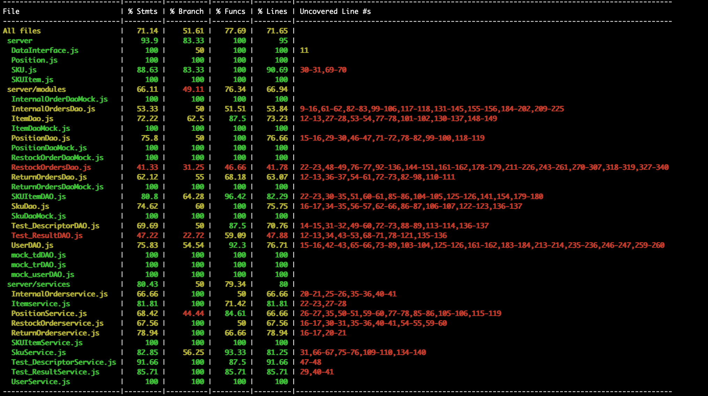

# Unit Testing Report

Date:

Version:

# Contents

- [Black Box Unit Tests](#black-box-unit-tests)

- [White Box Unit Tests](#white-box-unit-tests)

# Black Box Unit Tests

    <Define here criteria, predicates and the combination of predicates for each function of each class.
    Define test cases to cover all equivalence classes and boundary conditions.
    In the table, report the description of the black box test case and (traceability) the correspondence with the Jest test case writing the
    class and method name that contains the test case>
    <Jest tests  must be in code/server/unit_test  >
# Class **_ItemDao_**
### Class **_ItemDao_** - method **get_item_by_id(id)**

    In this method we check whether specific item by given id is onside the database or not, if exists the returned value is corresponding item and success status, othewise it will return zero to  API layer which means thers is not corrspondance to given id, and prints: "no item associated to id"

**Criteria**

| Criteria        | Description                                   |
| --------------- | --------------------------------------------- |
| EMPTY_DB        | There is not any stored item in database.                     |
| ITEM_EXISTANCE    | If there is an itEN with the given id     |
| ID_TYPE_CORRECT | If the type of the id param is correct or not |

**Predicates**

| Criteria        | Predicate  |
| --------------- | ---------- |
| DB_EMPTY        | True/False |
| ITEM_EXISTANCE  | True/False |
| ID_TYPE_CORRECT | True/False |

**Boundaries**:

| Criteria        | Boundary values |
| --------------- | :-------------: |
| DB_EMPTY        |       N/A       |
| ITEM_EXISTANCE  |       N/A       |
| ID_TYPE_CORRECT |       N/A       |

**Combination of predicates**:

| EMPTY_DB | ITEM_EXISTANCE | ID_TYPE_CORRECT | Valid / Invalid | Description of the test case             | Jest test case     |
| -------- | ------------ | --------------- | --------------- | ---------------------------------------- | ------------------ |
| TRUE     |              |                 | Valid           | If the db is empty, return 'no item associated to id'     | testgetItemNotexisted |
| FALSE    | FALSE        | TRUE            | Valid           | If the item is not inserted, returns '0'  | testgetItemNotexisted |
| FALSE    | TRUE         | TRUE            | Valid           | Return the item related to given id  | testgetItem |
| \*       | \*           | FALSE           | Invalid         | If the passed id is less than one      | testgetItemWithIdlessthanOne |

### **Class ItemDAO - method insert_into_item_table(item)**

Save an item (id: int, description: str, price: flaot, supplierId: int, idSku: int) into the database.

**Criteria for method insert_into_item_table :**

| Criteria             | Description                               |
| -------------------- | ----------------------------------------- |
| VALID_ITEM_TYPE      | If the item attributes have invalid attributes. |

**Predicates for method insert_into_item_table:**

| Criteria             | Predicate  |
| -------------------- | ---------- |
| VALID_ITEM_TYPE      | True/False |

**Boundaries**:

| Criteria             | Boundary values |
| -------------------- | --------------- |
| VALID_ITEM_TYPE      | null            |

**Combination of predicates**:

|  | VALID_ITEM_TYPE     | Valid / Invalid | Description of the test case           | Jest test case       |
| -------------------- | ------------------- | --------------- | -------------------------------------- | -------------------- |
|                 | TRUE                | Valid           | The item is correctly saved in the db  | testsetItem |
|                 | FALSE (null)        | Invalid         | The item is not saved, returns -1 | testsetEmptyItem |

### Class **_ItemDao_** - method **_modify_item(id,newItem)_**
Modifies given id of item with fields in the newItem object and returns the message which says: `Item with given id is updated`

**Criteria for method _modify_item:**

| Criteria              | Description                                        |
| --------------------- | -------------------------------------------------- |
| EMPTY_DB              |                                                    |
| ITEM_EXISTANCE       | Wheter item with the given id exists or not|
| VALID_NEW_ITEM_TYPE | Wheter the newItem attributes are valid or not|

**Predicates for method _modify_item:**

| Criteria              | Predicate  |
| --------------------- | ---------- |
| EMPTY_DB              | True/False |
| ITEM_EXISTANCE        | True/False |
| VALID_NEW_ITEM_TYPE   | True/False |

**Boundaries**:

| Criteria              | Boundary values |
| --------------------- | --------------- |
| VALID_NEW_ITEM_TYPE | null            |

**Combination of predicates**:

| EMPTY_DB | ITEM_EXISTANCE | VALID_SUPPLIERID_TYPE | Valid / Invalid | Description of the test case                        | Jest test case              |
| -------- | --------------- | --------------------- | --------------- | --------------------------------------------------- | --------------------------- |
| FALSE        | TRUE              | null                  | Invalid         | it should return -1                        | testupdateNullItem |
| FALSE    | TRUE            | TRUE                  | Valid           | it should resolve a message which says give item id is updated | testupdateItem |

# Class **_InternalOrderDao_**
### Class **_InternalOrderDao_** - method **get_item_by_id(id)**
    In this method we check whether specific Internal Order by given id is onside the database or not, if exists the returned value is corresponding Internal Order and success status, othewise it will return zero to  API layer which means thers is not corrspondance to given id, and prints: "no internal order associated to id"

**Criteria**

| Criteria        | Description                                   |
| --------------- | --------------------------------------------- |
| EMPTY_DB        | There is not any stored Internal Order in database.                     |
| IO_EXISTANCE    | If there is an Internal Order with the given id     |
| ID_TYPE_CORRECT | If the type of the id param is correct or not |

**Predicates**

| Criteria        | Predicate  |
| --------------- | ---------- |
| DB_EMPTY        | True/False |
| IO_EXISTANCE  | True/False |
| ID_TYPE_CORRECT | True/False |

**Boundaries**:

| Criteria        | Boundary values |
| --------------- | :-------------: |
| DB_EMPTY        |       N/A       |
| IO_EXISTANCE  |       N/A       |
| ID_TYPE_CORRECT |       N/A       |

**Combination of predicates**:

| EMPTY_DB | IO_EXISTANCE | ID_TYPE_CORRECT | Valid / Invalid | Description of the test case             | Jest test case     |
| -------- | ------------ | --------------- | --------------- | ---------------------------------------- | ------------------ |
| TRUE     |              |                 | Valid           | If the db is empty, return 'no IO associated to id'     | testgetIONotexisted |
| FALSE    | FALSE        | TRUE            | Valid           | If the IO is not inserted, returns '0'  | testgetIONotexisted |
| FALSE    | TRUE         | TRUE            | Valid           | Return the Internal order related to given id  | testIOgetById |
| \*       | \*           | FALSE           | Invalid         | If the passed id is less than one      | testgetIOWithIdlessthanOne  |

### **Class ItemDAO - method insert_internal_order(internalOrder)**

Save an Internal Order with  (id: int, issueDate: str, products: JSON, customerId: int, state: "ISSUED") into the database.

**Criteria for method insert_internal_order :**

| Criteria             | Description                               |
| -------------------- | ----------------------------------------- |
| VALID_IO_TYPE      | If the IO attributes have invalid attributes. |

**Predicates for method insert_into_item_table:**

| Criteria             | Predicate  |
| -------------------- | ---------- |
| VALID_IO_TYPE      | True/False |

**Boundaries**:

| Criteria             | Boundary values |
| -------------------- | --------------- |
| VALID_IO_TYPE      | null            |

**Combination of predicates**:

|  | VALID_IO_TYPE     | Valid / Invalid | Description of the test case           | Jest test case       |
| -------------------- | ------------------- | --------------- | -------------------------------------- | -------------------- |
|                 | TRUE                | Valid           | The IO is correctly saved in the db  | testsetIO |
|                 | FALSE (null)        | Invalid         | The IO is not saved, returns -1 |  testsetEmptyIO  |

### Class **_ItemDao_** - method **modify_internal_order(id,newIO)_**
Modifies given id of item with fields in the newItem object and returns the message which says: `Item with given id is updated`

**Criteria for method modify_internal_order:**

| Criteria              | Description                                        |
| --------------------- | -------------------------------------------------- |
| EMPTY_DB              |                                                    |
| IO_EXISTANCE       | Wheter IO with the given id exists or not|
| VALID_IO_TYPE | Wheter the newIO attributes are valid or not|

**Predicates for method _modify_item:**

| Criteria              | Predicate  |
| --------------------- | ---------- |
| EMPTY_DB              | True/False |
| IO_EXISTANCE        | True/False |
| VALID_IO_TYPE   | True/False |

**Boundaries**:

| Criteria              | Boundary values |
| --------------------- | --------------- |
| VALID_IO_TYPE | null            |

**Combination of predicates**:

| EMPTY_DB | ITEM_EXISTANCE | VALID_SUPPLIERID_TYPE | Valid / Invalid | Description of the test case                        | Jest test case              |
| -------- | --------------- | --------------------- | --------------- | --------------------------------------------------- | --------------------------- |
| FALSE        | TRUE              | null                  | Invalid         | it should return -1                        | testupdateNullIO |
| FALSE    | TRUE            | TRUE                  | Valid           | it should resolve a message which says give IO id is updated  | testupdateIO |
| FALSE    | TRUE            | TRUE                  | Valid           | it should resolve a message which says give IO id is updated  | testupdateIO |

### Class **_RestockorderDao_** - method get_restock_order_by_id(id)

    In this method we check whether specific RSO by given id is onside the database or not, if exists the returned value is corresponding RSO and success status, othewise it will return zero to  API layer which means thers is not corrspondance to given id, and prints: "no RSO associated to id"

**Criteria**

| Criteria        | Description                                   |
| --------------- | --------------------------------------------- |
| EMPTY_DB        | There is not any stored item in database.                     |
| RSO_EXISTANCE    | If there is an RSO with the given id     |
| ID_TYPE_CORRECT | If the type of the id param is correct or not |

**Predicates**

| Criteria        | Predicate  |
| --------------- | ---------- |
| DB_EMPTY        | True/False |
| RSO_EXISTANCE  | True/False |
| ID_TYPE_CORRECT | True/False |

**Boundaries**:

| Criteria        | Boundary values |
| --------------- | :-------------: |
| DB_EMPTY        |       N/A       |
| RSO_EXISTANCE  |       N/A       |
| ID_TYPE_CORRECT |       N/A       |

**Combination of predicates**:

| EMPTY_DB | RSO_EXISTANCE | ID_TYPE_CORRECT | Valid / Invalid | Description of the test case             | Jest test case     |
| -------- | ------------ | --------------- | --------------- | ---------------------------------------- | ------------------ |
| TRUE     |              |                 | Valid           | If the db is empty, return 'no RSO associated to id'     | testgetRSONotexisted |
| FALSE    | FALSE        | TRUE            | Valid           | If the RSO is not inserted, returns '0'  | testgetRSONotexisted |
| FALSE    | TRUE         | TRUE            | Valid           | Return the RSO related to given id  | testRSO |
| \*       | \*           | FALSE           | Invalid         | If the passed id is less than one      | testgetRSOWithIdlessthanOne |

### **Class ItemDAO - method insert_restock_order_table(RSO)**

Save an RSO (id: int, issueDate: str, products: JSON, description: ste, supplierId: int, state = "ISSUED" ) into the database.

**Criteria for method insert_restock_order_table:**

| Criteria             | Description                               |
| -------------------- | ----------------------------------------- |
| VALID_RSO_TYPE      | If the RSO attributes have invalid attributes. |

**Predicates for method insert_restock_order_table:**

| Criteria             | Predicate  |
| -------------------- | ---------- |
| VALID_RSO_TYPE      | True/False |

**Boundaries**:

| Criteria             | Boundary values |
| -------------------- | --------------- |
| VALID_RSO_TYPE      | null            |

**Combination of predicates**:

|  | VALID_RSO_TYPE     | Valid / Invalid | Description of the test case           | Jest test case       |
| -------------------- | ------------------- | --------------- | -------------------------------------- | -------------------- |
|                 | TRUE                | Valid           | The RSO is correctly saved in the db  | testsetRSO |
|                 | FALSE (null)        | Invalid         | The RSO is not saved, returns -1 | testsetEmptyRSO |

### Class **_ItemDao_** - method **modify_restock_order_table(id,newRSO)_**
Modifies given id of RSO with fields in the newRSO object and returns the message which says: `RSO with given id is updated`

**Criteria for method modify_restock_order_table:**

| Criteria              | Description                                        |
| --------------------- | -------------------------------------------------- |
| EMPTY_DB              |                                                    |
| RSO_EXISTANCE       | Wheter RSO with the given id exists or not|
| VALID_NEW_RSO_TYPE | Wheter the newRSO attributes are valid or not|

**Predicates for method modify_restock_order_table:**

| Criteria              | Predicate  |
| --------------------- | ---------- |
| EMPTY_DB              | True/False |
| RSO_EXISTANCE        | True/False |
| VALID_NEW_RSO_TYPE   | True/False |

**Boundaries**:

| Criteria              | Boundary values |
| --------------------- | --------------- |
| VALID_NEW_RSO_TYPE | null            |

**Combination of predicates**:

| EMPTY_DB | RSO_EXISTANCE | VALID_RSO_TYPE | Valid / Invalid | Description of the test case                        | Jest test case              |
| -------- | --------------- | --------------------- | --------------- | --------------------------------------------------- | --------------------------- |
| FALSE        | TRUE              | null                  | Invalid         | it should return -1                        | testupdateNullRSO |
| FALSE    | TRUE            | TRUE                  | Valid           | it should resolve a message which says give RSO id is updated | testupdateTPNRSO |

 
### Class **_ReturnOrderDao_** - method **get_all_RO_by_id(id)**

    In this method we check whether specific return order by given id is onside the database or not, if exists the returned value is corresponding return order and success status, othewise it will return zero to API layer which means thers is not corrspondance to given id, and prints: "no return order associated to id"

**Criteria**

| Criteria        | Description                                   |
| --------------- | --------------------------------------------- |
| EMPTY_DB        | There is not any stored return order in database.                     |
| RO_EXISTANCE    | If there is an RO with the given id     |
| ID_TYPE_CORRECT | If the type of the id param is correct or not |

**Predicates**

| Criteria        | Predicate  |
| --------------- | ---------- |
| DB_EMPTY        | True/False |
| RO_EXISTANCE  | True/False |
| ID_TYPE_CORRECT | True/False |

**Boundaries**:

| Criteria        | Boundary values |
| --------------- | :-------------: |
| DB_EMPTY        |       N/A       |
| RO_EXISTANCE  |       N/A       |
| ID_TYPE_CORRECT |       N/A       |

**Combination of predicates**:

| EMPTY_DB | RO_EXISTANCE | ID_TYPE_CORRECT | Valid / Invalid | Description of the test case             | Jest test case     |
| -------- | ------------ | --------------- | --------------- | ---------------------------------------- | ------------------ |
| TRUE     |              |                 | Valid           | If the db is empty, return 'no return order associated to id'     | testgetRONotexisted |
| FALSE    | FALSE        | TRUE            | Valid           | If the RO is not inserted, returns '0'  | testgetRONotexisted |
| FALSE    | TRUE         | TRUE            | Valid           | Return the RO related to given id  | testgetRO |
| \*       | \*           | FALSE           | Invalid         | If the passed id is less than one      | testgetROWithIdlessthanOne |

### **Class ItemDAO - method insert_return_order_table(RO)**

Save an item (id: int, description: str, price: flaot, supplierId: int, idSku: int) into the database.

**Criteria for method insert_return_order_table :**

| Criteria             | Description                               |
| -------------------- | ----------------------------------------- |
| VALID_RO_TYPE      | If the RO attributes have invalid attributes. |

**Predicates for method insert_into_item_table:**

| Criteria             | Predicate  |
| -------------------- | ---------- |
| VALID_RO_TYPE      | True/False |

**Boundaries**:

| Criteria             | Boundary values |
| -------------------- | --------------- |
| VALID_RO_TYPE      | null            |

**Combination of predicates**:

|  | VALID_RO_TYPE     | Valid / Invalid | Description of the test case           | Jest test case       |
| -------------------- | ------------------- | --------------- | -------------------------------------- | -------------------- |
|                 | TRUE                | Valid           | The RO is correctly saved in the db  | testsetRO |
|                 | FALSE (null)        | Invalid         | The RO is not saved, returns -1 | testsetEmptyRO |

# White Box Unit Tests

### Test cases definition

    <Report here all the created Jest test cases, and the units/classes under test >
    <For traceability write the class and method name that contains the test case>
## Test cases for Item
| Unit name | Jest test case |     |
| --------- | -------------- | --- |
|test itemDao|get Item||
|test itemDao|get not existed Item||
|test itemDao|new item is inserted||
|test itemDao|set Item||
|test itemDao|set empty Item||
|test itemDao|update Item||
|test itemDao|update null Item||

## Test cases for Internal Orders
| Unit name | Jest test case |     |
| --------- | -------------- | --- |
|test internal order|testIOgetById||
|test internal order|testgetIOWithIdlessthanOne||
|test internal order|testgetIONotexisted||
|test internal order|testsetIO||
|test internal order|testsetEmptyIO||
|test internal order|testupdateIO||
|test internal order|testupdateNullIO||

# please do not write here
## Test cases for Internal Orders
| Unit name | Jest test case |     |
| --------- | -------------- | --- |
|test restock order|get restock order||
|test restock order|get not existed RSO||
|test restock order|get RSO with id less than one||
|test restock order|set empty RSO||
|test restock order|test set empty RSO||
|test restock order|update trasportnote of RSO||
|test restock order|update state of RSO||
|test restock order|update null RSO||
# please do not write here
## Test cases for Return Orders
| Unit name | Jest test case |     |
| --------- | -------------- | --- |
|test return order|get retun order||
|test return order|get not existed RO||
|test return order|get wrong id type for RO ||
|test return order|set empty RO||
|test return order|set RO||

### Code coverage report

# please do not write here

## Test cases for SKU
| Unit name | Jest test case |     |
| --------- | -------------- | --- |
|Sku |create sku||
|Sku |modify sku without position||
|Sku |add position to sku||
|Sku |modify sku with position||
|Sku |modify position of sku||
